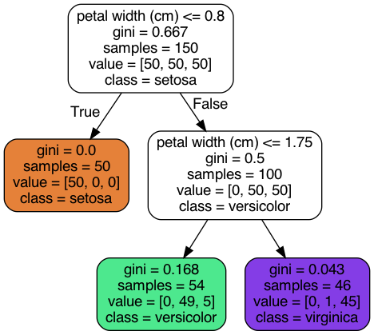
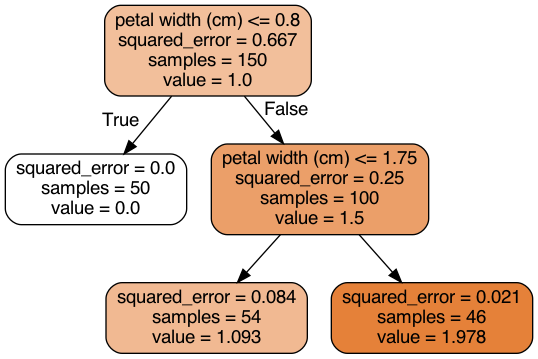

# Ensemble-learning and random forests

The exercise discusses

**Decision trees**
* Training and visializing decision tree for classification

* Training and visializing decision tree for regression  

**Random forests**
* Voting classifers (hard vs soft)
* Bagging and pasting
* Out-of-bag evaluation
* Random forest classifier 
* Feature importance
* Boosting
  * Adaptive boosting (Adaboost)
  * Gradient boosting (XGboost)
* Blending

This is based on the book Chapter 6 and 7 of Hands on [Machine Learning with Sckit-learn, Keras, and Tensorflow](https://www.oreilly.com/library/view/hands-on-machine-learning/9781492032632/) by Aurelien Geron. 
